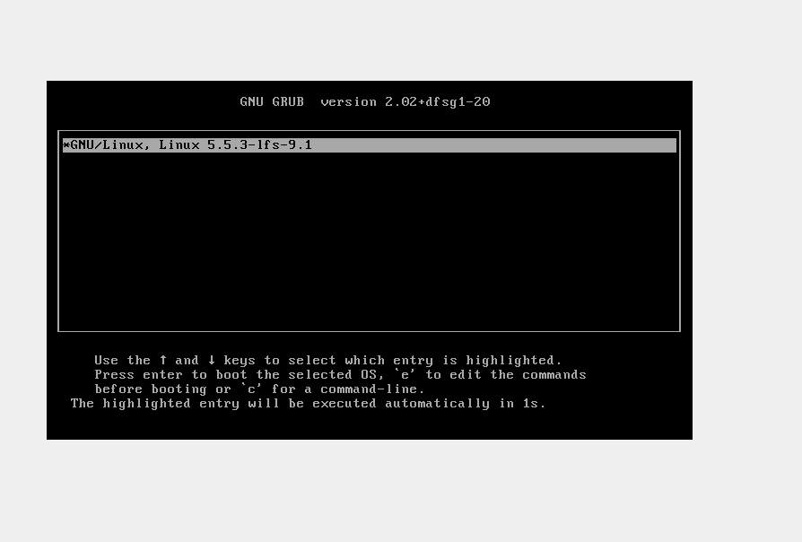
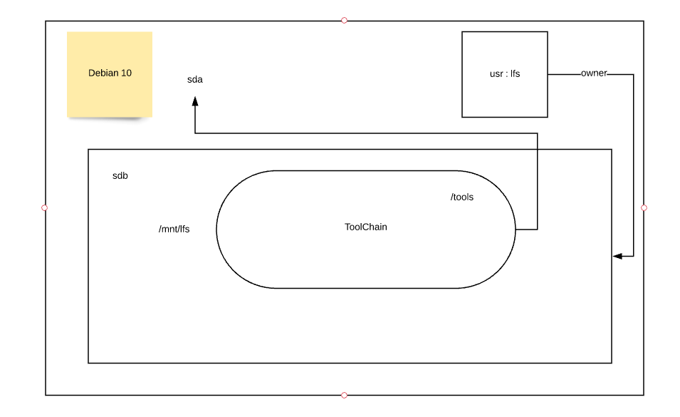

## DistroLinuxF0ns1
Under construction

## How to mount new FileSystem on Virtual machine:
 logic architecture

After many local comiplations for al src code on VM, we create a root directory on new mounted fileSystem, with the follow linux strxuture:

# original Hard Disk vdi mounted, for new distro:

	/bin/lsblk  | grep sdb
	sdb      8:16   0   30G  0 disk 
	├─sdb1   8:17   0   10G  0 part /mnt/lfs
	├─sdb2   8:18   0    1K  0 part 
	├─sdb5   8:21   0    2G  0 part [SWAP]
	└─sdb6   8:22   0 18,1G  0 part /mnt/lfs/home

	ls -ltrh /dev/sdb*
	brw-rw---- 1 root root 8, 16 Apr 25 02:55 /dev/sdb
	brw-rw---- 1 root root 8, 18 Apr 25 02:55 /dev/sdb2
	brw-rw---- 1 root root 8, 21 Apr 25 02:55 /dev/sdb5
	brw-rw---- 1 root root 8, 22 Apr 25 02:55 /dev/sdb6
	brw-rw---- 1 root root 8, 17 Apr 25 02:55 /dev/sdb1

	df -h | grep /dev/sdb
	/dev/sdb1        9,8G   6,1G  3,2G  66% /mnt/lfs
	/dev/sdb6         18G   1,5G   16G   9% /mnt/lfs/home

# New environment on /mnt/lfs

usign chroot for change root directory / to /mnt/lfs

script:
	cat /mnt/lfs/chroot_lfs.sh 

	#!/bin/bash
	LFS=/mnt/lfs
	echo "Root directory: $LFS"
		/mnt/lfs/tools/bin/chroot "$LFS" /tools/bin/env -i    \
		HOME=/root                      \
		TERM="$TERM"                    \
		PS1='(lfs chroot) \u:\w\$ '     \
		PATH=/bin:/usr/bin:/sbin:/usr/sbin:/tools/bin     \
		/tools/bin/bash --login +h

create tree directory structure for linux Operative System execution:

	(lfs chroot) root:/# ls -ltrh /
	total 84K
	drwx------   2 root root  16K Apr 24 15:33 lost+found
	dr-xr-xr-x 182 root root    0 Apr 25 00:55 proc
	drwxr-xr-x  11 root root 4.0K Apr 25 01:58 tools
	dr-xr-xr-x  13 root root    0 Apr 25 01:59 sys
	drwxr-xr-x  17 root root 3.3K Apr 25 04:03 dev
	drwxrwxrwt   2 root root   40 Apr 25 14:10 run
	drwxrwxr-x   2 root root 4.0K Apr 25 16:14 lib64
	-rwxrwxr-x   1 root root  286 Apr 25 16:28 chroot_lfs.sh
	drwxrwxr-x   2 root root 4.0K Apr 25 16:56 opt
	drwxrwxr-x   2 root root 4.0K Apr 25 16:56 mnt
	drwxrwxr-x   3 root root 4.0K Apr 25 16:56 lib
	drwxrwxr-x   2 root root 4.0K Apr 25 16:56 boot
	drwxrwxr-x   2 root root 4.0K Apr 25 16:57 srv
	drwxrwxr-x   2 root root 4.0K Apr 25 16:57 sbin
	drwxrwxr-x   4 root root 4.0K Apr 25 16:57 media
	drwxrwxr-x  10 root root 4.0K Apr 25 16:59 var
	drwxrwxr-x   2 root root 4.0K Apr 25 17:00 bin
	drwxrwxrwt   2 root root 4.0K Apr 25 17:01 tmp
	drwxrwxr-x   4 root root 4.0K Apr 25 17:01 etc
	drwxr-x---   2 root root 4.0K Apr 25 17:01 root
	drwxrwxr-x  14 root root 4.0K Apr 25 17:03 usr
	drwxr-xr-x   4 root root 4.0K Apr 25 17:08 home

# New virtual file system:

	(lfs chroot) root:/# df -a
	Filesystem     1K-blocks    Used Available Use% Mounted on
	/dev/sdb1       10218068 6327548   3351744  66% /
	/dev/sdb6       18516200 1548212  16004356   9% /home
	udev             2000936       0   2000936   0% /dev
	devpts                 0       0         0    - /dev/pts
	proc                   0       0         0    - /proc
	sysfs                  0       0         0    - /sys
	tmpfs            2020764       0   2020764   0% /run

# Grub new Distro : DistroLinuxFonsi

# Create Your own distro:

# 1. installation process of toolchain:

## 1.1 Set Environment:

	mkdir -v $LFS/tools
	ln -sv $LFS/tools /
	
## 1.2 Create lfs user 
	
	groupadd lfs
	useradd -s /bin/bash -g lfs -m -k /dev/null lfs
	passwd lfs
	chown -v lfs $LFS/tools
	chown -v lfs $LFS/sources
	su - lfs
	
## 1.3 configure environment for user 
	
	cat > ~/.bash_profile << "EOF"
	exec env -i HOME=$HOME TERM=$TERM PS1='\u:\w\$ ' /bin/bash
	EOF
	
	cat > ~/.bashrc << "EOF"
	set +h
	umask 022
	LFS=/mnt/lfs
	LC_ALL=POSIX
	LFS_TGT=$(uname -m)-lfs-linux-gnu
	PATH=/tools/bin:/bin:/usr/bin
	export LFS LC_ALL LFS_TGT PATH
	EOF
	
	source ~/.bash_profile

## 2.0 Construct temporary system 

## 2.1 Create new toolChain:

You mus crete a new specific user on your OS, the selected name could be lfs.

configuration user environment  vars, on .bashrc of /hom/lfs directory :

	set +h
	umask 002
	LFS=/mnt/lfs
	LC_ALL=POSIX
	LFS_TGT=$(uname -m)-lfs-linux-gnu
	PATH=/tools/bin:/bin:/usr/bin
	export LFS LC_ALL LFS_TGT PATH

 The build instructions assume that the Host System Requirements, including symbolic links, have been set properly:

    bash is the shell in use.

    sh is a symbolic link to bash.

    /usr/bin/awk is a symbolic link to gawk.

    /usr/bin/yacc is a symbolic link to bison or a small script that executes bison.

	lfs@debian-f0ns1:/tools/lib$ ls  -ltrh /usr/bin/bash
	-rwxr-xr-x 1 root root 1.2M Apr 18  2019 /usr/bin/bash
	lfs@debian-f0ns1:/tools/lib$ ls  -ltrh /usr/bin/sh  
	lrwxrwxrwx 1 root root 4 Apr 24 03:01 /usr/bin/sh -> bash
	lfs@debian-f0ns1:/tools/lib$ ls  -ltrh /usr/bin/awk 
	lrwxrwxrwx 1 root root 4 Apr 24 05:47 /usr/bin/awk -> gawk
	lfs@debian-f0ns1:/tools/lib$ ls  -ltrh /usr/bin/yacc 
	lrwxrwxrwx 1 root root 5 Apr 24 05:46 /usr/bin/yacc -> bison

## 2.2 Toolchain: [basic gcc] self-compile and self-linked libraries

When we finish the core toolchain compilation, it be able to make that simple test:

	echo 'int main(){}' > dummy.c
	$LFS_TGT-gcc dummy.c
	readelf -l a.out | grep ': /tools'

If everything is working correctly, there should be no errors, and the output of the last command will be of the form:

[Requesting program interpreter: /tools/lib64/ld-linux-x86-64.so.2]

Note that for 32-bit machines, the interpreter name will be /tools/lib/ld-linux.so.2.

	rm -v dummy.c a.out

Libraries that we need on directory:

	$LFS/home/sources:
	ls -ltrh | grep gcc   #gcc 
	-rw-r--r--  1 lfs   lfs    68M Apr 24 18:04 gcc-9.2.0.tar.xz
	lfs@debian-f0ns1:/mnt/lfs/home/sources$ ls -ltrh | grep mpfr #gcc dependency
	-rw-r--r--  1 lfs   lfs   1.4M Apr 24 18:04 mpfr-4.0.2.tar.xz
	lfs@debian-f0ns1:/mnt/lfs/home/sources$ ls -ltrh | grep gmp #gcc dependency
	-rw-r--r--  1 lfs   lfs   2.0M Apr 24 18:04 gmp-6.2.0.tar.xz
	lfs@debian-f0ns1:/mnt/lfs/home/sources$ ls -ltrh | grep mpc #gcc dependency
	-rw-r--r--  1 lfs   lfs   685K Apr 24 18:04 mpc-1.1.0.tar.gz
	lfs@debian-f0ns1:/mnt/lfs/home/sources$ ls -ltrh | grep linux-5 #linux api headers
	-rw-r--r--  1 lfs   lfs   106M Apr 24 18:04 linux-5.5.3.tar.xz
	lfs@debian-f0ns1:/mnt/lfs/home/sources$ ls -ltrh | grep glibc  #glibc 
	-rw-r--r--  1 lfs   lfs    16M Apr 24 18:04 glibc-2.31.tar.xz
	ls -ltrh binutils-2.34.tar.xz # linux core utils
	-rw-r--r-- 1 lfs lfs 21M Apr 24 18:04 binutils-2.34.tar.xz

For recreate the scenary is completly mandatory, follow the next steps:

	1.Compile binutils
	2.Compile gcc with dependencies
	3.Compile Linux API
	4.Compile glibc 

2.2.1.Compile bin utils:

	tar xf linux-5.5.3.tar.xz
	cd linux-5.5.3
	mkdir -v build
	cd       build
	../configure --prefix=/tools            \
             --with-sysroot=$LFS        \
             --with-lib-path=/tools/lib \
             --target=$LFS_TGT          \
             --disable-nls              \
             --disable-werror
	make
	case $(uname -m) in
  		x86_64) mkdir -v /tools/lib && ln -sv lib /tools/lib64 ;;
	esac
	make install
	cd ../../
	rm -fr linux-5.5.3.tar
	
2.2.2 Compile Gcc with dependencies:

	tar xf gcc-9.2.0.tar.xz
	cd gcc-9.2.0
	tar -xf ../mpfr-4.0.2.tar.xz
	mv -v mpfr-4.0.2 mpfr
	tar -xf ../gmp-6.2.0.tar.xz
	mv -v gmp-6.2.0 gmp
	tar -xf ../mpc-1.1.0.tar.gz
	mv -v mpc-1.1.0 mpc
	for file in gcc/config/{linux,i386/linux{,64}}.h
	do
  		cp -uv $file{,.orig}
		sed -e 's@/lib\(64\)\?\(32\)\?/ld@/tools&@g' \
		      -e 's@/usr@/tools@g' $file.orig > $file
		echo '
		#undef STANDARD_STARTFILE_PREFIX_1
		#undef STANDARD_STARTFILE_PREFIX_2
		#define STANDARD_STARTFILE_PREFIX_1 "/tools/lib/"
		#define STANDARD_STARTFILE_PREFIX_2 ""' >> $file
		touch $file.orig
	done
	case $(uname -m) in
  		x86_64)
    		sed -e '/m64=/s/lib64/lib/' \
        		-i.orig gcc/config/i386/t-linux64;;
	esac
	mkdir -v build
	cd       build
	../configure                                       \
	    --target=$LFS_TGT                              \
	    --prefix=/tools                                \
	    --with-glibc-version=2.11                      \
	    --with-sysroot=$LFS                            \
	    --with-newlib                                  \
	    --without-headers                              \
	    --with-local-prefix=/tools                     \
	    --with-native-system-header-dir=/tools/include \
	    --disable-nls                                  \
	    --disable-shared                               \
	    --disable-multilib                             \
	    --disable-decimal-float                        \
	    --disable-threads                              \
	    --disable-libatomic                            \
	    --disable-libgomp                              \
	    --disable-libquadmath                          \
	    --disable-libssp                               \
	    --disable-libvtv                               \
	    --disable-libstdcxx                            \
	    --enable-languages=c,c++
	make
	make install
	cd ../../
	rm -fr gcc-9.2.0

2.2.3 Compile Linux API:
	
	tar xf linux-5.5.3.tar.xz
	cd linux-5.5.3
	make mrproper
	make headers
	cp -rv usr/include/* /tools/include
	cd ../
	rm -fr linux-5.5.3
	
2.2.4 Compile Glibc:

	tar xf glibc-2.31.tar.xz
	cd glibc-2.31
	mkdir -v build
	cd       build
	../configure                             \
	      --prefix=/tools                    \
	      --host=$LFS_TGT                    \
	      --build=$(../scripts/config.guess) \
	      --enable-kernel=3.2                \
	      --with-headers=/tools/include
	 make
	 make install
	 

## Test executed success:

	lfs@debian-f0ns1:/mnt/lfs$ source ~/.bash_profile 
	
	lfs@debian-f0ns1:/mnt/lfs$ cat test.c 
	#include <stdio.h>
	int main() {
  	 // printf() displays the string inside quotation
  	 printf("Hi, guys ! toolchain compilationo ....");
  	 return 0;
	}
	lfs@debian-f0ns1:/mnt/lfs$ $LFS_TGT-gcc test.c
	 
	lfs@debian-f0ns1:/mnt/lfs$ ./a.out 
	Hi, guys ! toolchain compilationo ....
	
	lfs@debian-f0ns1:/mnt/lfs$ readelf -l a.out | grep ': /tools'
      		[Requesting program interpreter: /tools/lib64/ld-linux-x86-64.so.2]

## 2.3 install all packages from scracth (src) on new toolchain:

	2.3.1 Libstdc++ from GCC-9.2.0
	2.3.2 Binutils-2.34 - Pass 2
	2.3.3 GCC-9.2.0 - Pass 2
	2.3.4 Tcl-8.6.10
	2.3.5 Expect-5.45.4
	2.3.6 DejaGNU-1.6.2
	2.3.7 M4-1.4.18
	2.3.8 Ncurses-6.2
	2.3.9 Bash-5.0
	2.3.10 Bison-3.5.2
	2.3.11 Bzip2-1.0.8
	2.3.12 Coreutils-8.31
	2.3.13 Diffutils-3.7
	2.3.14 File-5.38
	2.3.15 Findutils-4.7.0
	2.3.16 Gawk-5.0.1
	2.3.17 Gettext-0.20.1
	2.3.18 Grep-3.4
	2.3.19 Gzip-1.10
	2.3.20 Make-4.3
	2.3.21 Patch-2.7.6
	2.3.22 Perl-5.30.1
	2.3.23 Python-3.8.1
	2.3.24 Sed-4.8
	2.3.25 Tar-1.32
	2.3.26 Texinfo-6.7
	2.3.27 Xz-5.2.4 

## 2.3.1 Libstdc++ from GCC-9.2.0
	
	ttar xf gcc-9.2.0.tar.xz
	cd gcc-9.2.0
	mkdir -v build
	cd       build
	../libstdc++-v3/configure           \
    	--host=$LFS_TGT                 \
    	--prefix=/tools                 \
    	--disable-multilib              \
    	--disable-nls                   \
    	--disable-libstdcxx-threads     \
    	--disable-libstdcxx-pch         \
    	--with-gxx-include-dir=/tools/$LFS_TGT/include/c++/9.2.0
    	make
    	make install
	cd ../../
	rm gcc-9.2.0
	
## 2.3.2 Binutils-2.34 - Pass 2

	tar xf binutils-2.34
	cd binutils-2.34
	mkdir -v build
	cd  build
	CC=$LFS_TGT-gcc                \
	AR=$LFS_TGT-ar                 \
	RANLIB=$LFS_TGT-ranlib         \
	../configure                   \
	    --prefix=/tools            \
	    --disable-nls              \
	    --disable-werror           \
	    --with-lib-path=/tools/lib \
	    --with-sysroot
	make
	make install
	make -C ld clean
	make -C ld LIB_PATH=/usr/lib:/lib
	cp -v ld/ld-new /tools/bin
	cd ../../
	rm binutils-2.34
	
## 2.3.3 GCC-9.2.0 - Pass 2

	ttar xf gcc-9.2.0.tar.xz
	cd gcc-9.2.0
	
	cat gcc/limitx.h gcc/glimits.h gcc/limity.h > \
  `	dirname $($LFS_TGT-gcc -print-libgcc-file-name)`/include-fixed/limits.h
	
	for file in gcc/config/{linux,i386/linux{,64}}.h
	do
	  cp -uv $file{,.orig}
	  sed -e 's@/lib\(64\)\?\(32\)\?/ld@/tools&@g' \
	      -e 's@/usr@/tools@g' $file.orig > $file
	echo '
	#undef STANDARD_STARTFILE_PREFIX_1
	#undef STANDARD_STARTFILE_PREFIX_2
	#define STANDARD_STARTFILE_PREFIX_1 "/tools/lib/"
	#define STANDARD_STARTFILE_PREFIX_2 ""' >> $file
	  touch $file.orig
	done
	
	case $(uname -m) in
	  x86_64)
	    sed -e '/m64=/s/lib64/lib/' \
		-i.orig gcc/config/i386/t-linux64
	  ;;
	esac
	
	tar -xf ../mpfr-4.0.2.tar.xz
	mv -v mpfr-4.0.2 mpfr
	tar -xf ../gmp-6.2.0.tar.xz
	mv -v gmp-6.2.0 gmp
	tar -xf ../mpc-1.1.0.tar.gz
	mv -v mpc-1.1.0 mpc
	
	sed -e '1161 s|^|//|' \
	    -i libsanitizer/sanitizer_common/sanitizer_platform_limits_posix.cc
	
	mkdir -v build
	cd       build
	
	make
	make install
	ln -sv gcc /tools/bin/cc
	
	cd ../../
	rm -fr gcc-9.2.0.tar.xz

## Test executed success:

	lfs@debian-f0ns1:/mnt/lfs$ source ~/.bash_profile 
	
	lfs@debian-f0ns1:/mnt/lfs$ cat test.c 
	#include <stdio.h>
	int main() {
  	 // printf() displays the string inside quotation
  	 printf("Hi, guys ! toolchain compilationo ....");
  	 return 0;
	}
	lfs@debian-f0ns1:/mnt/lfs$ cc test.c
	 
	lfs@debian-f0ns1:/mnt/lfs$ ./a.out 
	Hi, guys ! toolchain compilationo ....
	
	lfs@debian-f0ns1:/mnt/lfs$ readelf -l a.out | grep ': /tools'
      		[Requesting program interpreter: /tools/lib64/ld-linux-x86-64.so.2]
	

## 2.3.4 Tcl-8.6.10

	
## 2.3.5 Expect-5.45.4
## 2.3.6 DejaGNU-1.6.2
## 2.3.7 M4-1.4.18
## 2.3.8 Ncurses-6.2
## 2.3.9 Bash-5.0
## 2.3.10 Bison-3.5.2
## 2.3.11 Bzip2-1.0.8
## 2.3.12 Coreutils-8.31
## 2.3.13 Diffutils-3.7
## 2.3.14 File-5.38
## 2.3.15 Findutils-4.7.0
## 2.3.16 Gawk-5.0.1
## 2.3.17 Gettext-0.20.1
## 2.3.18 Grep-3.4
## 2.3.19 Gzip-1.10
## 2.3.20 Make-4.3
## 2.3.21 Patch-2.7.6
## 2.3.22 Perl-5.30.1
## 2.3.23 Python-3.8.1
## 2.3.24 Sed-4.8
## 2.3.25 Tar-1.32
## 2.3.26 Texinfo-6.7
## 2.3.27 Xz-5.2.4 
